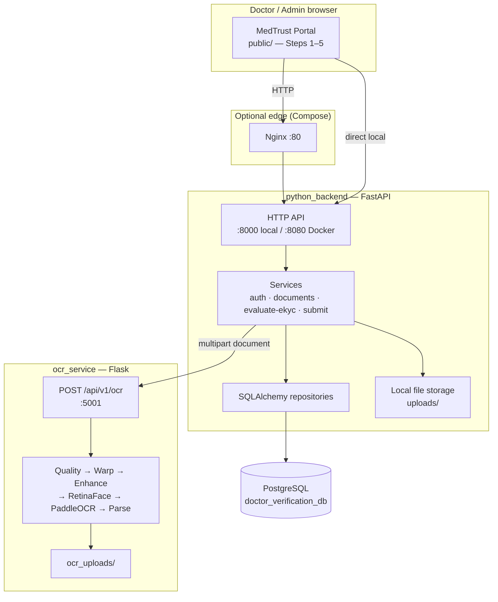
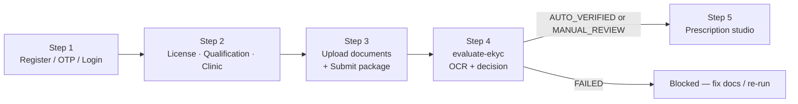
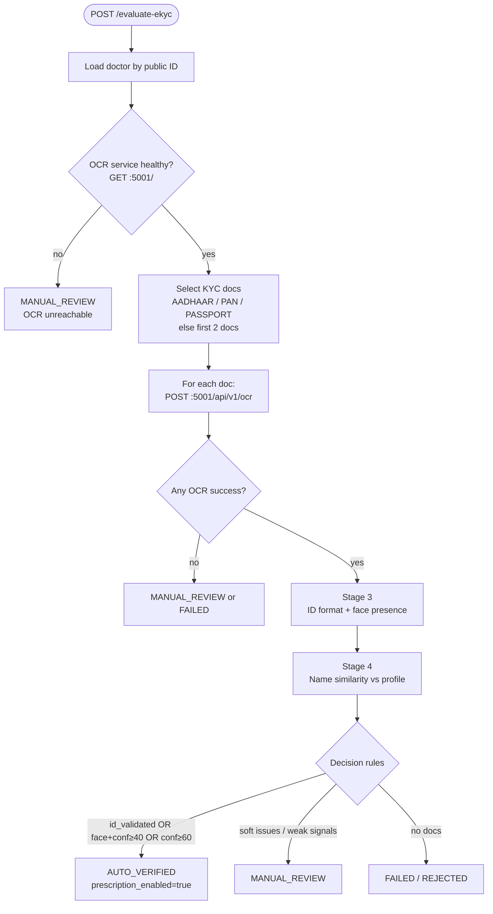
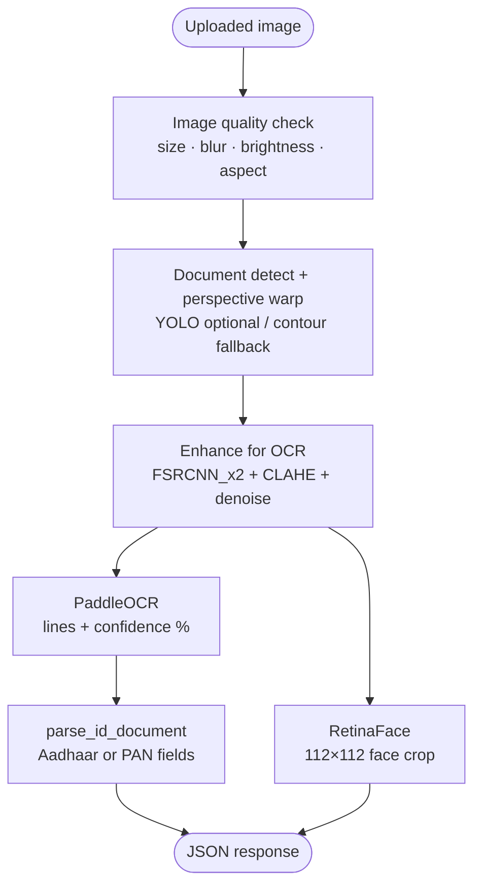

# ZuDoc — Doctor Verification & eKYC Portal

Enterprise-style **doctor identity verification (eKYC)** for healthcare platforms. Doctors register, upload credentials and government IDs, run an automated OCR + face-extraction evaluation, then unlock clinical workflows (e.g. digital prescriptions).

**Repository:** [github.com/Saravanan2005real/zudoc-doctor-portal-EKYC](https://github.com/Saravanan2005real/zudoc-doctor-portal-EKYC)

---

## What this system does

| Goal | How it is achieved |
|------|--------------------|
| Trust doctors before clinical actions | Multi-step wizard + OCR of Aadhaar/PAN + face presence + name cross-match |
| Keep identity checks automated | Flask OCR microservice (PaddleOCR + RetinaFace + image enhancement) |
| Persist audit trail | PostgreSQL via SQLAlchemy + verification history |
| Demo the full loop locally | FastAPI serves API **and** the MedTrust portal UI from one process |

---

## Tech stack

| Layer | Technology |
|-------|------------|
| Portal UI | Vanilla HTML / CSS / JS (`public/`) |
| Backend API | **FastAPI** + Uvicorn + Pydantic (`python_backend/`) |
| ORM / DB | SQLAlchemy 2 + **PostgreSQL** |
| OCR microservice | **Flask** + PaddleOCR + RetinaFace + OpenCV SR/CLAHE (`ocr_service/`) |
| Auth | Password hash + SMS OTP (mock prints to console) + JWT / refresh tokens |
| Deploy | Docker Compose, Nginx, Kubernetes manifests |

> This repository is **Python-only**. The previous Go backend has been removed.

---

## Architecture (current runtime)

Two long-running services plus a database:



### Component map

| Component | Path | Port | Responsibility |
|-----------|------|------|----------------|
| Portal + API | `python_backend/` (serves `public/`) | **8000** local / **8080** Compose | Auth, wizard APIs, document vault, **evaluate-ekyc**, prescriptions |
| OCR microservice | `ocr_service/app.py` | **5001** | Image quality, document warp, SR enhance, face crop, OCR, Aadhaar/PAN parse |
| Database | PostgreSQL | **5433** local default / **5432** Compose | Doctors, docs, OTP, history, jobs |
| Nginx | `nginx.conf` | **80** | Reverse proxy to API (Compose only) |

---

## End-to-end doctor pipeline (Steps 1–5)

This is the **live wizard path** used by the portal.



### Step 1 — Registration & auth

1. Doctor registers with mobile + password → `POST /api/v1/doctors/register`
2. Backend hashes password, creates `Doctor` (`NOT_SUBMITTED`), generates 6-digit OTP
3. Mock SMS provider **prints OTP in the FastAPI terminal**
4. Doctor verifies OTP → `POST /api/v1/doctors/verify-otp` → JWT + refresh token
5. Returning users: `POST /api/v1/doctors/login`

Wizard identity for later steps is primarily the header **`X-Doctor-Public-ID`**.

### Step 2 — Credentials

| Data | Endpoint |
|------|----------|
| Medical license / council / year | `POST /api/v1/doctors/licenses` |
| Degree / university / year | `POST /api/v1/doctors/qualifications` |
| Clinic / practice listing | `POST /api/v1/doctors/clinics` |
| Optional profile | `PUT /api/v1/doctors/profile` |

### Step 3 — Document vault + submit

1. Upload multipart files → `POST /api/v1/doctors/documents`
2. Backend validates type/size, SHA-256 hash, optional virus-scan hook, versions files under `uploads/doctors/{public_id}/documents/`
3. Checklist before submit: mobile verified, license, qualification, clinic, registration cert, degree cert, government ID (`AADHAAR` / `PAN` / `PASSPORT`)
4. Submit package → `POST /api/v1/doctors/submit-verification` → status `PENDING`, history row, optional `VerificationJob` enqueued
5. UI advances to Step 4 and starts evaluation

### Step 4 — eKYC evaluation (core pipeline)

Triggered by **`POST /api/v1/doctors/evaluate-ekyc`** with `X-Doctor-Public-ID`.

Implemented in `python_backend/services/ekyc_evaluation_service.py`.



#### Stage breakdown (returned to UI as `stages[]`)

| # | Stage | What happens |
|---|-------|----------------|
| 1 | Application Submitted | Doctor + package loaded |
| 2 | eKYC OCR + Face Extraction | Health-check OCR; send each KYC image; store face/processed URLs |
| 3 | ID Format & Face Visibility | Aadhaar Verhoeff / PAN format flags; `face_detected` if RetinaFace crop exists; best OCR confidence |
| 4 | Profile Cross-Match | Token Jaccard similarity of OCR name vs `first_name + last_name` (0–100%) |
| 5 | Final Decision | `AUTO_VERIFIED` / `MANUAL_REVIEW` / `FAILED` |

#### Decision rules (summary)

- **FAILED** — no documents to evaluate (status becomes `REJECTED`)
- **AUTO_VERIFIED** — ID validated **or** (face detected and OCR confidence ≥ 40%) **or** confidence ≥ 60%
- **MANUAL_REVIEW** — OCR down / all OCR failed with errors / signals too weak; soft reasons include missing ID validation, missing face, or name score &lt; 40%

#### Step 5 unlock

| Outcome | Doctor status | `prescription_enabled` | UI Step 5 |
|---------|---------------|------------------------|-----------|
| `AUTO_VERIFIED` | `AUTO_VERIFIED` | `true` | Unlocked |
| `MANUAL_REVIEW` | `MANUAL_REVIEW` | `false` | Unlocked in UI for demo continuity |
| `FAILED` | `REJECTED` | `false` | Blocked — re-upload / re-run |

> **Note:** Portal Step 4 uses face **extraction / presence** (RetinaFace), not DeepFace live matching. Live webcam match lives on the OCR service’s own `/live` demo (`POST /api/v1/live_verify`).

### Step 5 — Digital prescription studio

After a non-failed Step 4 decision, the UI opens the prescription form → `POST /api/v1/prescriptions`.

---

## OCR microservice pipeline (inside `:5001`)

Every `POST /api/v1/ocr` call runs this chain:



### Success response (high level)

```json
{
  "status": "success",
  "quality_check": { "passed": true },
  "perspective_corrected": true,
  "raw_text": ["..."],
  "ocr_confidence": 72.5,
  "parsed_fields": {
    "document_type": "AADHAAR",
    "name": "...",
    "dob": "...",
    "aadhaar_number": "...",
    "aadhaar_number_validated": true
  },
  "processed_image_url": "/ocr_uploads/processed_....jpg",
  "face_image_url": "/ocr_uploads/aadhaar_face_....jpg"
}
```

| Document | Key parsed fields |
|----------|-------------------|
| Aadhaar | name, dob, gender, aadhaar_number, `aadhaar_number_validated` (Verhoeff) |
| PAN | name, father_name, dob, pan_number, `pan_number_validated` |

**OCR endpoints**

| Method | Path | Purpose |
|--------|------|---------|
| `GET` | `/` | Demo upload UI + health target |
| `GET` | `/live` | Live webcam verification UI |
| `POST` | `/api/v1/ocr` | Main OCR used by portal Step 4 |
| `POST` | `/api/v1/live_verify` | Live frame + optional DeepFace match |
| `GET` | `/ocr_uploads/<file>` | Served crops / processed images |

Keep `ocr_service/FSRCNN_x2.pb` — required for super-resolution enhancement.

---

## Designed async verification job pipeline (secondary)

Submit also can enqueue a `VerificationJob` (`FULL_PIPELINE`). The design intent (also sketched under `python_backend/verification/`) is:

```text
QUEUED → OCR → Compare → Council registry → Fraud rules → Decision → Admin review / DLQ
```

The **wizard Step 4 path does not wait on this worker**. Day-to-day local demos rely on the **synchronous `evaluate-ekyc`** flow above. Compose may still start Redis/RabbitMQ for a production-shaped topology.

---

## Project structure

```text
eKYC/
├── python_backend/          # FastAPI app, services, entities, repositories
│   ├── main.py              # App entry, static UI, health endpoints
│   ├── controllers/         # HTTP routes
│   ├── services/            # Auth, documents, ekyc_evaluation, …
│   ├── entities/            # SQLAlchemy models
│   ├── repositories/
│   ├── storage/             # Local / S3 / Cloudinary adapters
│   ├── sms/                 # Mock / MSG91 / Twilio
│   └── uploads/             # Runtime doctor documents
├── ocr_service/             # Flask OCR + face microservice
│   ├── app.py
│   ├── FSRCNN_x2.pb
│   └── ocr_uploads/         # Runtime OCR artifacts
├── public/                  # Portal UI (index.html, app.js, styles)
├── migrations/              # SQL schema 000001–000006
├── docs/
│   ├── ARCHITECTURE.md      # Detailed Mermaid diagrams
│   └── openapi.yaml
├── k8s/                     # Deployment, Service, Ingress, HPA, secrets
├── docker-compose.yml
├── Dockerfile
├── nginx.conf
├── DESIGN.md
└── README.md
```

---

## Prerequisites

- **Python 3.10+**
- **PostgreSQL** with database `doctor_verification_db`
- Optional: Docker / Docker Compose

---

## Quick start (local)

### 1. Database

Create DB `doctor_verification_db`. Defaults used by the backend:

| Variable | Default |
|----------|---------|
| `DB_HOST` | `localhost` |
| `DB_PORT` | `5433` |
| `DB_USER` | `postgres` |
| `DB_PASSWORD` | `dinesh_2006` |
| `DB_NAME` | `doctor_verification_db` |

Apply SQL under `migrations/` if you prefer explicit schema; local/dev also runs `Base.metadata.create_all` on startup.

### 2. OCR microservice (required for Step 4)

```bash
cd ocr_service
pip install -r requirements.txt
python app.py
```

→ `http://127.0.0.1:5001`

### 3. FastAPI backend + portal

```bash
cd python_backend
pip install -r requirements.txt
python -m uvicorn main:app --host 127.0.0.1 --port 8000
```

→ Portal: [http://127.0.0.1:8000](http://127.0.0.1:8000)

OTP codes appear in the **backend terminal** (mock SMS).

> Keep **both** processes running. Step 4 fails into `MANUAL_REVIEW` if OCR on `:5001` is down. First OCR call can take a long time while models load (UI timeout is ~300s).

---

## Docker Compose

```bash
docker compose up --build
```

| Service | URL / port |
|---------|------------|
| Portal / API (direct) | http://localhost:8080 |
| Nginx | http://localhost:80 |
| OCR | http://localhost:5001 |
| Postgres | localhost:5432 |
| Redis | 6379 |
| RabbitMQ | 5672 / management 15672 |

---

## Key API surface

| Area | Endpoints |
|------|-----------|
| Auth | `POST /api/v1/doctors/register` · `/verify-otp` · `/login` |
| Credentials | `POST /api/v1/doctors/licenses` · `/qualifications` · `/clinics` |
| Documents | `POST/GET/DELETE /api/v1/doctors/documents` |
| Submit | `POST /api/v1/doctors/submit-verification` |
| **eKYC** | `POST /api/v1/doctors/evaluate-ekyc` |
| Prescriptions | `POST /api/v1/prescriptions` |
| Health | `GET /health/live` · `/health/ready` · `/metrics` |
| Admin (UI present; APIs partially stubbed) | `/api/v1/admin/...` |

Fuller contract: [`docs/openapi.yaml`](docs/openapi.yaml).

---

## Configuration

| Variable | Purpose |
|----------|---------|
| `JWT_SECRET` | Access token signing |
| `DB_*` | PostgreSQL connection |
| `PORT` | Backend listen port (Compose/K8s often `8080`) |
| `OCR_SERVICE_URL` | Default `http://127.0.0.1:5001/api/v1/ocr` |

---

## Database migrations (overview)

| Migration | Adds |
|-----------|------|
| `000001` | Core doctors, licenses, quals, clinics, documents, history |
| `000002` | OTP + refresh tokens, mobile verified / lockout |
| `000003` | Profile + document metadata (hash, size, filename) |
| `000004` | `verification_jobs`, `document_ocr_results` |
| `000005` | Admin review tables, assign / prescription flags |
| `000006` | Audit events, DLQ, prescriptions |

---

## Deployment notes

- **Kubernetes:** `k8s/` — Deployment (3 replicas), Service, Ingress, ConfigMap, Secret, HPA; probes on `/health/live` and `/health/ready`
- **CI:** `.github/workflows/ci-cd.yml` — Python checks + Docker image build on `main`
- Runtime OCR uploads under `ocr_service/ocr_uploads/` are generated data; do not treat them as source

---

## Further reading

- [`docs/ARCHITECTURE.md`](docs/ARCHITECTURE.md) — detailed Mermaid views (system context, sequences, OCR internals, deploy)
- [`DESIGN.md`](DESIGN.md) — design goals, domain model, extensibility
- [`docs/openapi.yaml`](docs/openapi.yaml) — API contract

---

## License / status

Internal / project demo for ZuDoc doctor onboarding and eKYC evaluation. Production SMS, cloud OCR credentials, and full admin review wiring are intentionally left as provider swaps — see `DESIGN.md` non-goals.
