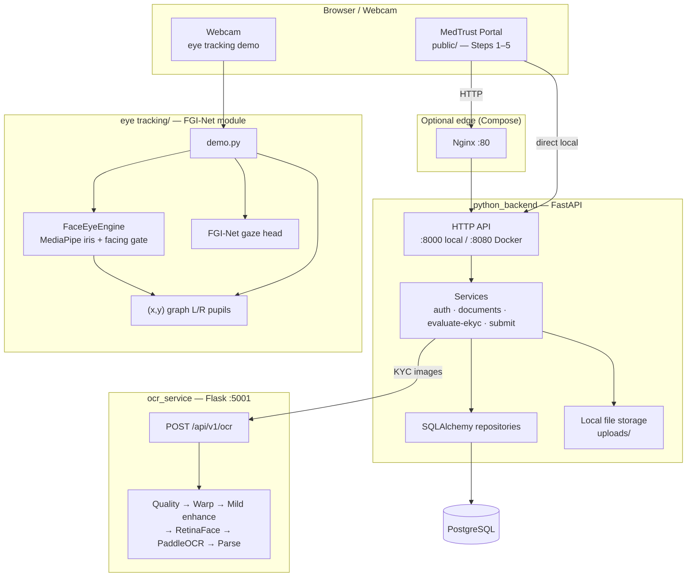
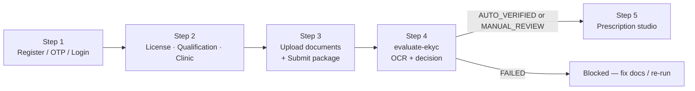
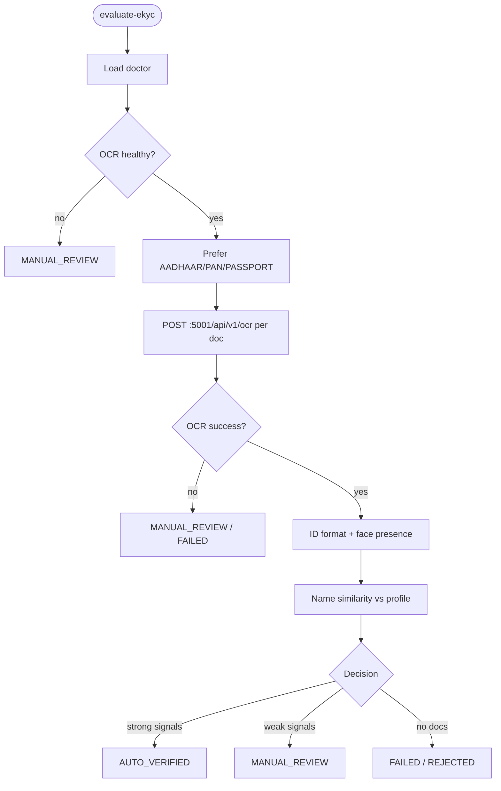
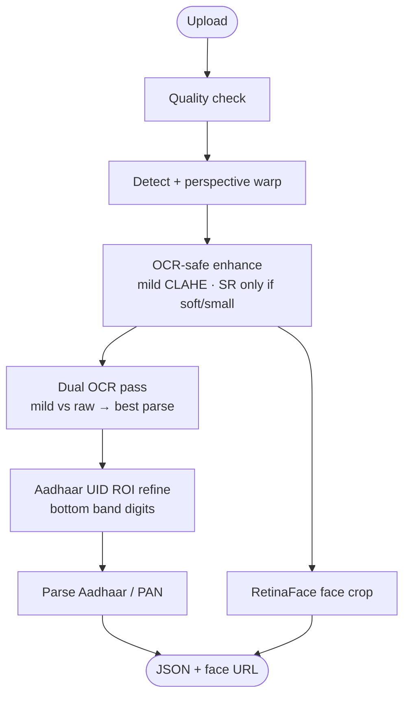

# ZuDoc — Doctor Verification, eKYC & Eye Tracking

Enterprise-style **doctor identity verification (eKYC)** for healthcare platforms, plus a standalone **FGI-Net eye-tracking** module for gaze direction and per-eye (x, y) plots.

**Repository:** [github.com/Saravanan2005real/zudoc-doctor-portal-EKYC](https://github.com/Saravanan2005real/zudoc-doctor-portal-EKYC)

---

## What this system does

| Goal | How it is achieved |
|------|--------------------|
| Trust doctors before clinical actions | Multi-step wizard + OCR of Aadhaar/PAN + face presence + name cross-match |
| Keep identity checks automated | Flask OCR microservice (PaddleOCR + RetinaFace + OCR-safe enhancement) |
| Persist audit trail | PostgreSQL via SQLAlchemy + verification history |
| Track live gaze / liveness signal | FGI-Net + MediaPipe iris → top / bottom / left / right / center + (x,y) graph |
| Demo the full loop locally | FastAPI serves API **and** portal UI; eye tracking runs as a webcam demo |

---

## Tech stack

| Layer | Technology |
|-------|------------|
| Portal UI | Vanilla HTML / CSS / JS (`public/`) |
| Backend API | **FastAPI** + Uvicorn + Pydantic (`python_backend/`) |
| ORM / DB | SQLAlchemy 2 + **PostgreSQL** |
| OCR microservice | **Flask** + PaddleOCR + RetinaFace + OpenCV (`ocr_service/`) |
| Eye tracking | **FGI-Net** (PyTorch) + MediaPipe Face Mesh + OpenCV (`eye tracking/`) |
| Auth | Password hash + SMS OTP (mock prints to console) + JWT / refresh tokens |
| Deploy | Docker Compose, Nginx, Kubernetes manifests |

> This repository is **Python-only**. The previous Go backend has been removed.

---

## System architecture (full platform)

Three product surfaces share one repo: the **doctor portal**, the **OCR microservice**, and the **eye-tracking module**.



### Component map

| Component | Path | Port / entry | Responsibility |
|-----------|------|--------------|----------------|
| Portal + API | `python_backend/` | **:8000** / **:8080** | Auth, wizard APIs, documents, **evaluate-ekyc**, prescriptions |
| OCR microservice | `ocr_service/app.py` | **:5001** | Aadhaar/PAN OCR, face crop, Verhoeff/format checks |
| Eye tracking | `eye tracking/demo.py` | Webcam process | Both-eyes facing gate, pupil (x,y), direction label |
| Database | PostgreSQL | **:5433** local / **:5432** Compose | Doctors, docs, OTP, history |
| Nginx | `nginx.conf` | **:80** | Reverse proxy (Compose) |

See also: [`docs/ARCHITECTURE.md`](docs/ARCHITECTURE.md), [`DESIGN.md`](DESIGN.md), [`eye tracking/README.md`](eye%20tracking/README.md).

---

## End-to-end doctor pipeline (Steps 1–5)



### Step 1 — Registration & auth

1. Register → `POST /api/v1/doctors/register`
2. Backend creates `Doctor` (`NOT_SUBMITTED`), hashes password, stores OTP
3. Mock SMS **prints OTP in the FastAPI terminal**
4. Verify → `POST /api/v1/doctors/verify-otp` → JWT + refresh token
5. Login → `POST /api/v1/doctors/login`

Wizard identity for later steps is primarily **`X-Doctor-Public-ID`**.

### Step 2 — Credentials

| Data | Endpoint |
|------|----------|
| License / council / year | `POST /api/v1/doctors/licenses` |
| Degree / university / year | `POST /api/v1/doctors/qualifications` |
| Clinic | `POST /api/v1/doctors/clinics` |
| Profile | `PUT /api/v1/doctors/profile` |

### Step 3 — Document vault + submit

1. Upload → `POST /api/v1/doctors/documents` (type + file + hash + versioning)
2. Checklist: mobile verified, license, qualification, clinic, reg cert, degree, govt ID
3. Submit → `POST /api/v1/doctors/submit-verification` → `PENDING`
4. UI advances to Step 4

### Step 4 — eKYC evaluation

`POST /api/v1/doctors/evaluate-ekyc` → `python_backend/services/ekyc_evaluation_service.py`



| Stage | Meaning |
|-------|---------|
| 1 Application Submitted | Package loaded |
| 2 OCR + Face Extraction | Call OCR microservice |
| 3 ID & Face Check | Verhoeff / PAN format + face crop present |
| 4 Name Cross-Match | OCR name vs profile (Jaccard %) |
| 5 Final Decision | `AUTO_VERIFIED` / `MANUAL_REVIEW` / `FAILED` |

**Decision summary**

- **AUTO_VERIFIED** — ID validated **or** (face + OCR conf ≥ 40%) **or** conf ≥ 60%
- **MANUAL_REVIEW** — OCR down / weak signals / soft mismatches
- **FAILED** — no documents (status → `REJECTED`)

### Step 5 — Prescription studio

Unlocked in UI when Step 4 is not `FAILED` → `POST /api/v1/prescriptions`.

---

## OCR microservice pipeline (`:5001`)



**Important OCR fixes in this tree**

- Aggressive Level-2 denoise/unsharp was harming Latin text → **mild enhance** by default
- Aadhaar Verhoeff no longer invents alternate digits to force VALID
- Prefers spaced `XXXX XXXX XXXX` and ROI OCR for the UID
- Rejects Tamil→Latin name garbage (e.g. `UDSIL IFTHIBLD`)

| Method | Path | Purpose |
|--------|------|---------|
| `GET` | `/` | Demo UI + health |
| `GET` | `/live` | Live webcam verify UI |
| `POST` | `/api/v1/ocr` | Portal Step 4 OCR |
| `POST` | `/api/v1/live_verify` | Live frame + optional DeepFace |
| `GET` | `/ocr_uploads/<file>` | Crops / processed images |

---

## Eye tracking module (`eye tracking/`)

Standalone webcam module built around **FGI-Net** (*Fusion Global Information* gaze estimator) plus **MediaPipe Face Mesh** iris landmarks.

### Goals

1. Face may appear **anywhere** in the frame
2. Track + plot **only when both eyes face the camera**
3. Predict **top / bottom / left / right / center**
4. Live **(x, y)** graph for left and right pupils (`x,y ∈ [-1, 1]`)

### Architecture

```mermaid
flowchart TD
  CAM([Webcam frame]) --> MP[MediaPipe Face Mesh + iris]
  MP --> FACE{Both eyes open<br/>and facing camera?}
  FACE -->|no| WAIT[Pause plot<br/>turn_to_camera / no_face]
  FACE -->|yes| PUPIL[Per-eye pupil x,y]
  PUPIL --> CAL[Auto-center calibrator<br/>remove resting upward bias]
  CAL --> DIR[Direction classifier]
  CAL --> GRAPH[(x,y) graph L/R trails]
  DIR --> LABEL[Looking: TOP/BOTTOM/LEFT/RIGHT/CENTER]
  FACE -->|yes| FGI[FGI-Net face crop → pitch/yaw]
  FGI -.->|optional refine with real weights| DIR
```

### Package layout

```text
eye tracking/
├── FGI-Net/                 # Upstream architecture reference
├── fgi_eye_tracker/         # Our package
│   ├── fgi_net.py           # Import-safe FGI-Net
│   ├── face_eyes.py         # MediaPipe + OpenCV fallback
│   ├── eyes.py              # Pupil ROI + direction rules
│   ├── calibrate.py         # Resting-gaze center lock
│   ├── plot.py              # Live Cartesian graph
│   ├── tracker.py           # EyeTracker API
│   └── preprocess.py        # Face crop normalize for FGI-Net
├── weights/
│   ├── fgi_net.pth          # Checkpoint (architecture-init unless replaced)
│   └── fgi_benchmark.json   # Local size / latency numbers
├── demo.py
├── requirements.txt
└── scripts/
    ├── init_weights.py
    └── benchmark_fgi.py
```

### Run eye tracking

```powershell
cd "eye tracking"
python -m venv .venv
.\.venv\Scripts\activate
pip install -r requirements.txt
python demo.py
```

- Face the camera and look **straight** ~1s for auto-center calibration
- Then look top / bottom / left / right — graph updates while both eyes face the camera
- **Esc** to quit

### FGI-Net size & speed (measured on this project’s CPU host)

| Metric | Value |
|--------|------:|
| Parameters | **~1.52 M** |
| Checkpoint | **~6.1 MB** |
| Paper FLOPs / our MACs | **~0.38 G** |
| Mean latency (CPU, 224²) | **~25 ms** (~40 FPS) |
| Paper angular error (MPIIFaceGaze) | **3.74°** (needs author-trained weights) |

> Upstream [CZ178/FGI-Net](https://github.com/CZ178/FGI-Net) publishes architecture; trained paper weights are not on GitHub. Bundled `fgi_net.pth` is an architecture-compatible init for wiring/smoke tests unless you replace it. Direction in the demo is driven primarily by **iris geometry** (works without paper weights).

---

## Project structure

```text
eKYC/
├── python_backend/          # FastAPI portal backend
├── ocr_service/             # Flask OCR + face microservice
├── eye tracking/            # FGI-Net eye tracking module + demo
├── public/                  # Portal UI
├── migrations/              # SQL 000001–000006
├── docs/                    # ARCHITECTURE.md, openapi.yaml
├── k8s/
├── docker-compose.yml
├── Dockerfile
├── nginx.conf
├── DESIGN.md
└── README.md
```

---

## Prerequisites

- **Python 3.10+**
- **PostgreSQL** (`doctor_verification_db`) for the portal
- Webcam for eye tracking
- Optional: Docker / Docker Compose

---

## Quick start (portal + OCR)

### 1. Database

| Variable | Default |
|----------|---------|
| `DB_HOST` | `localhost` |
| `DB_PORT` | `5433` |
| `DB_USER` | `postgres` |
| `DB_PASSWORD` | `dinesh_2006` |
| `DB_NAME` | `doctor_verification_db` |

### 2. OCR

```bash
cd ocr_service
pip install -r requirements.txt
python app.py
```

→ `http://127.0.0.1:5001`

### 3. Portal

```bash
cd python_backend
pip install -r requirements.txt
python -m uvicorn main:app --host 127.0.0.1 --port 8000
```

→ `http://127.0.0.1:8000` — OTP prints in the backend terminal.

Keep **both** OCR and FastAPI running for Step 4.

---

## Docker Compose

```bash
docker compose up --build
```

| Service | URL / port |
|---------|------------|
| Portal / API | http://localhost:8080 |
| Nginx | http://localhost:80 |
| OCR | http://localhost:5001 |
| Postgres | localhost:5432 |

---

## Key API surface

| Area | Endpoints |
|------|-----------|
| Auth | `POST /api/v1/doctors/register` · `/verify-otp` · `/login` |
| Credentials | `POST /api/v1/doctors/licenses` · `/qualifications` · `/clinics` |
| Documents | `POST/GET/DELETE /api/v1/doctors/documents` |
| Submit | `POST /api/v1/doctors/submit-verification` |
| **eKYC** | `POST /api/v1/doctors/evaluate-ekyc` |
| Prescriptions | `POST /api/v1/prescriptions` |
| Health | `GET /health/live` · `/health/ready` · `/metrics` |

---

## Configuration

| Variable | Purpose |
|----------|---------|
| `JWT_SECRET` | Access token signing |
| `DB_*` | PostgreSQL |
| `PORT` | Backend listen port |
| `OCR_SERVICE_URL` | Default `http://127.0.0.1:5001/api/v1/ocr` |

---

## Further reading

- [`docs/ARCHITECTURE.md`](docs/ARCHITECTURE.md) — Mermaid system / sequence / deploy views
- [`eye tracking/README.md`](eye%20tracking/README.md) — eye module quick start
- [`DESIGN.md`](DESIGN.md) — design goals & extensibility
- [`docs/openapi.yaml`](docs/openapi.yaml) — API contract

---

## License / status

Internal / project demo for ZuDoc doctor onboarding, eKYC evaluation, and gaze tracking experiments. Production SMS, cloud OCR credentials, author-trained FGI weights, and full admin review wiring remain provider swaps — see `DESIGN.md` non-goals.
