# Architecture — ZuDoc Doctor eKYC Portal + Eye Tracking

This document is the **source of truth** for system diagrams. It matches the **Python** runtime: FastAPI portal backend + Flask OCR microservice + PostgreSQL + FGI-Net eye-tracking module.

> Diagrams use [Mermaid](https://mermaid.js.org/) and render on GitHub.

For a shorter overview and setup guide, see the root [`README.md`](../README.md).

---

## 1. System context

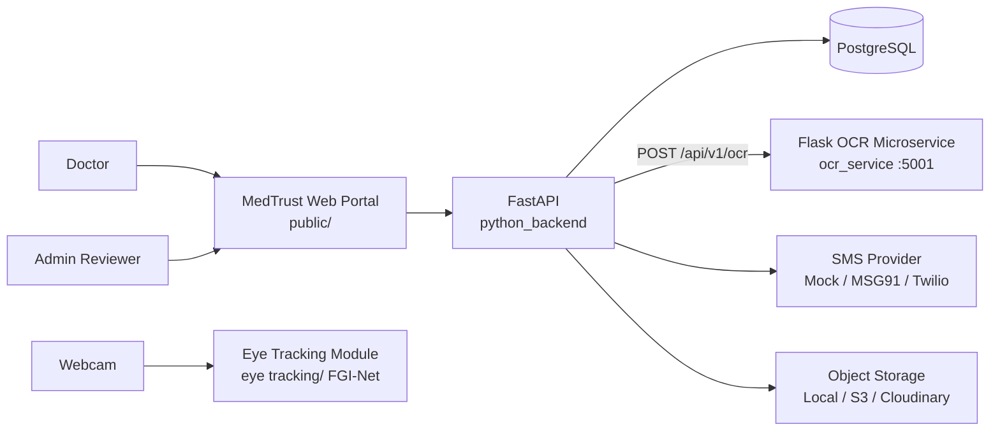

**What is real today for the doctor wizard**

- Auth, credentials, documents, submit, **synchronous `evaluate-ekyc`**, UI Step 5
- OCR microservice for Aadhaar/PAN parse + RetinaFace face crop (OCR-safe enhance + UID ROI)

**Eye tracking (standalone demo today)**

- MediaPipe iris + both-eyes facing gate + (x,y) plot + direction classifier
- FGI-Net loaded for optional pitch/yaw refine when real weights are present

**Designed / partial**

- Async `VerificationJob` worker (council → fraud → decision)
- Full admin review service wiring (UI exists; many admin routes are stubs)
- Wiring eye-tracking signals into portal Step 4 / liveness
- Redis / RabbitMQ in Compose for a production-shaped topology

---

## 2. Runtime topology

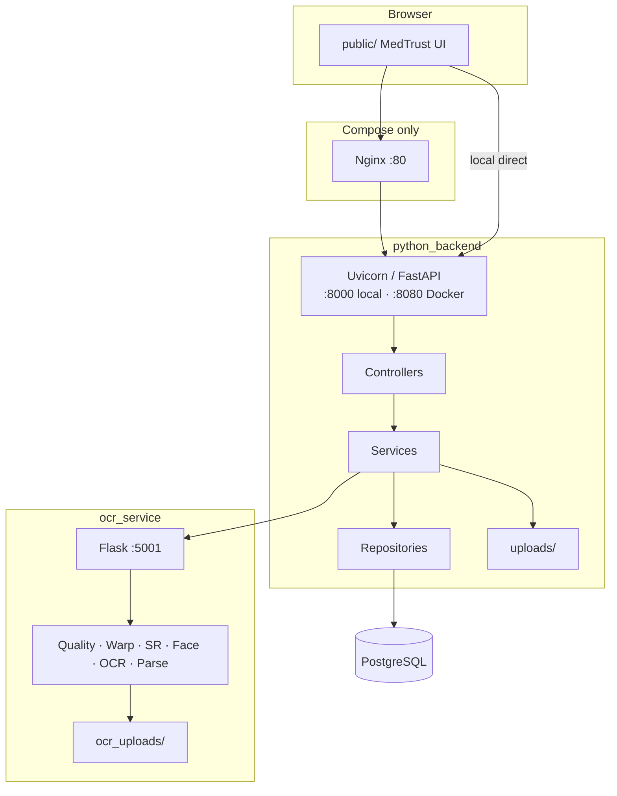

| Process | Default local | Compose |
|---------|---------------|---------|
| Portal + API | `127.0.0.1:8000` | `:8080` (+ Nginx `:80`) |
| OCR | `127.0.0.1:5001` | `:5001` |
| Postgres | `:5433` (common local) | `:5432` |

Health:

- API: `GET /health/live`, `GET /health/ready`, `GET /metrics`
- OCR: `GET /` (also used as readiness probe by evaluate-ekyc)

---

## 3. Layered backend packages

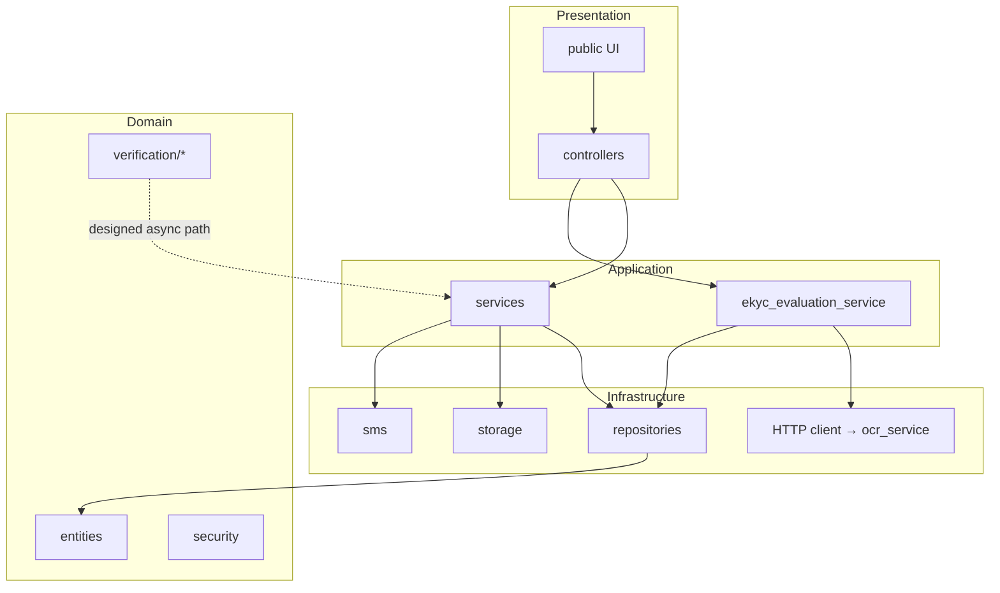

---

## 4. Doctor wizard sequence (live path)

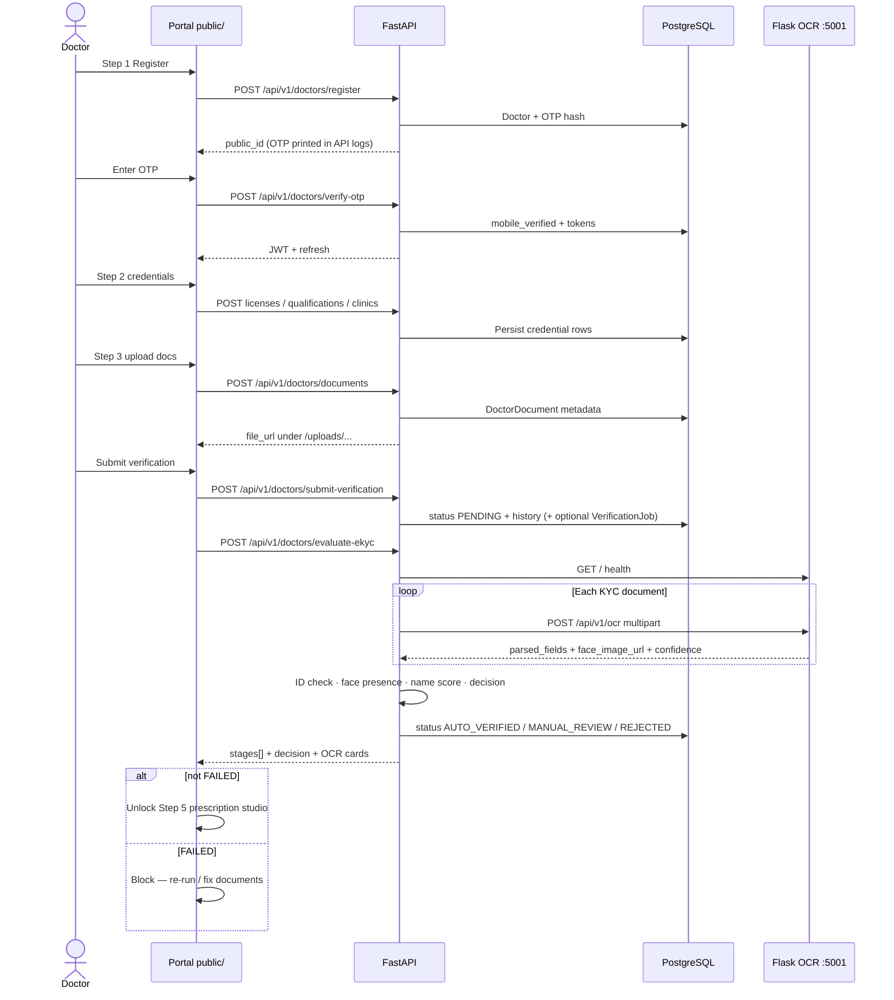

---

## 5. Step 4 evaluate-ekyc — decision pipeline

Entry: `POST /api/v1/doctors/evaluate-ekyc`  
Service: `python_backend/services/ekyc_evaluation_service.py`

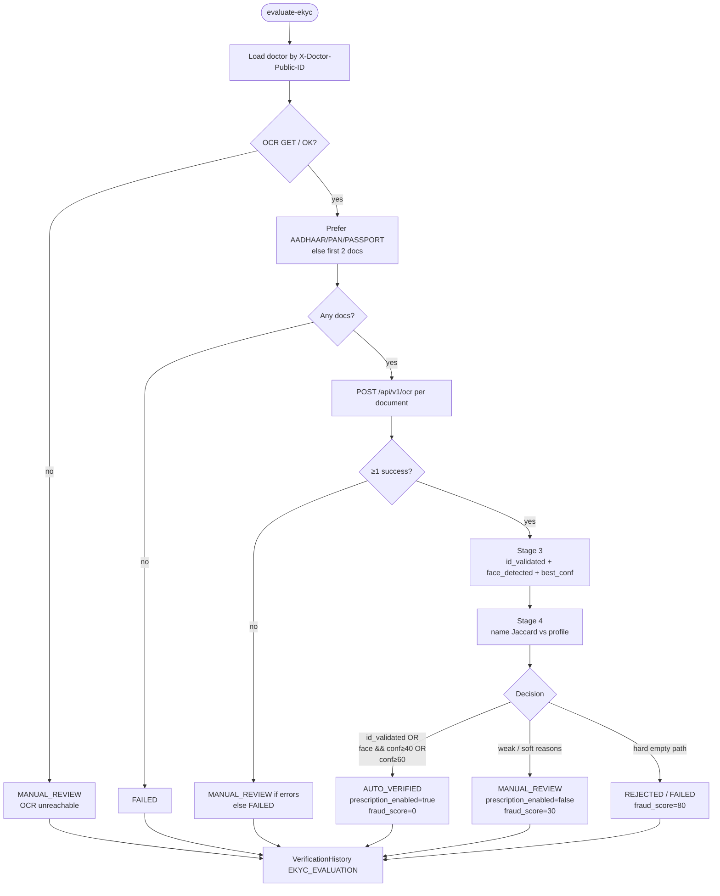

### Soft reasons that push messaging toward MANUAL_REVIEW

- KYC present but ID number not validated
- KYC present but no face crop
- OCR name present and name similarity &lt; 40%

### UI vs backend unlock

| Decision | Backend `prescription_enabled` | Portal Step 5 button |
|----------|--------------------------------|----------------------|
| AUTO_VERIFIED | true | shown |
| MANUAL_REVIEW | false | shown (demo continuity) |
| FAILED | false | hidden |

---

## 6. OCR microservice internal pipeline

File: `ocr_service/app.py` — `POST /api/v1/ocr`

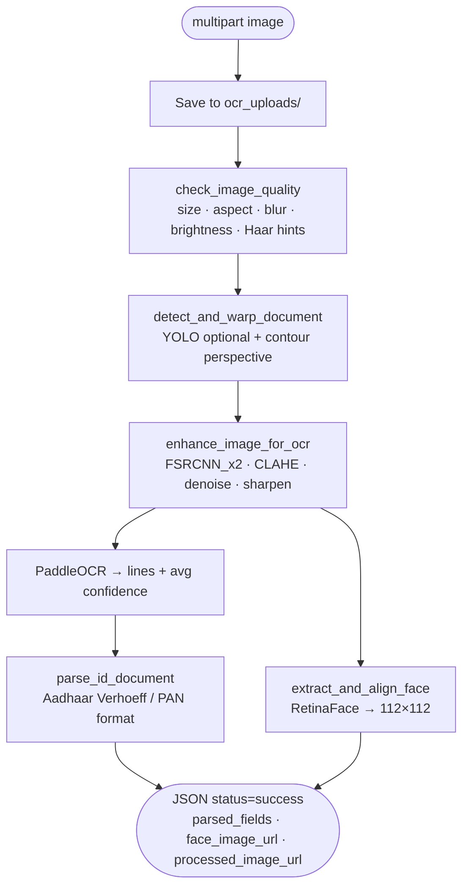

### Optional live path (OCR demo UI only)

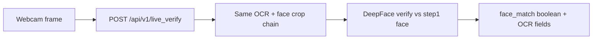

Portal Step 4 does **not** call DeepFace. It only consumes `/api/v1/ocr`.

---

## 7. Document upload flow

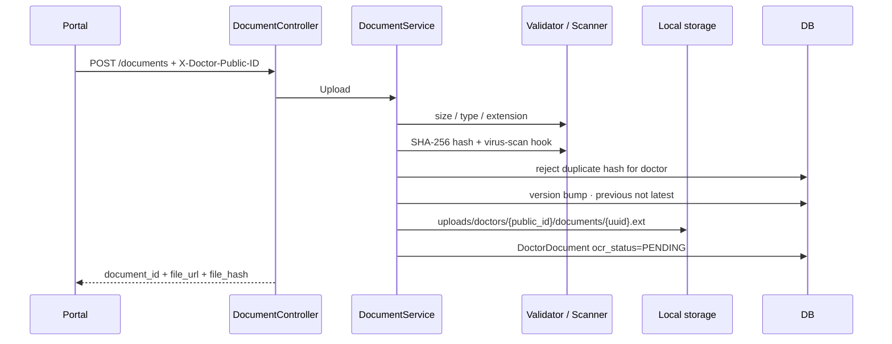

Supported types include: `REGISTRATION_CERTIFICATE`, medical degree variants, `AADHAAR`, `PAN`, `PASSPORT`.

---

## 8. Auth flow

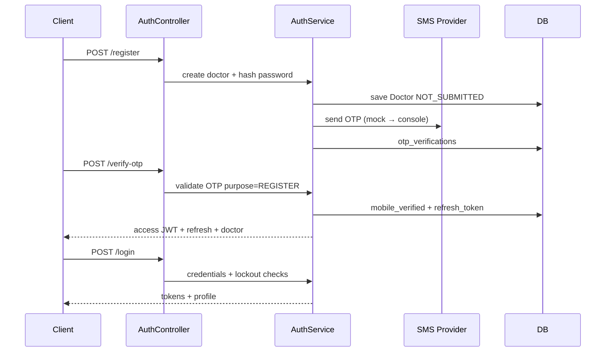

---

## 9. Designed async job pipeline (secondary)

Submit may insert `VerificationJob` with status `QUEUED` and type `FULL_PIPELINE`.

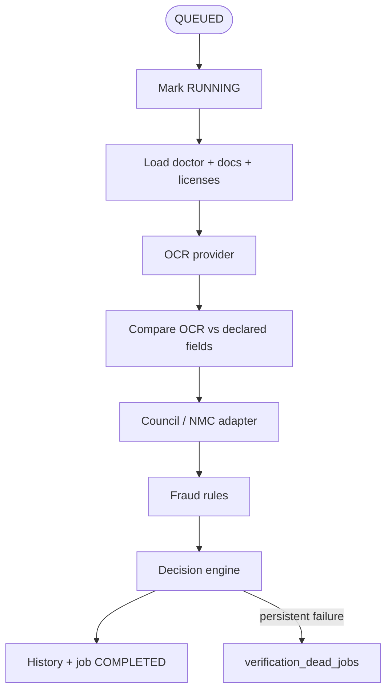

This path is **not** what Step 4 waits on. Day-to-day demos use synchronous `evaluate-ekyc`.

---

## 10. Deployment views

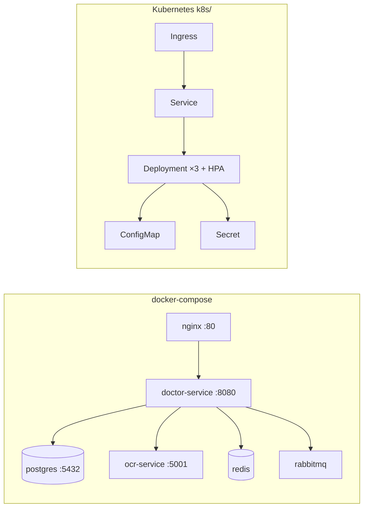

---

## 11. Trust boundaries

| Boundary | Control |
|----------|---------|
| Browser → API | Optional Nginx; route rate limits; JWT on auth paths |
| Uploads → disk | Type/size validation, content hash, scanner hook |
| API → OCR | HTTP timeouts (evaluate uses long OCR timeout); health check first |
| Doctor → prescriptions | `prescription_enabled` / verified-status intent (`PrescriptionAuthGuard`) |
| Admin → status changes | Explicit admin APIs + action audit (when fully wired) |
| Webcam → eye tracker | Local process only; both-eyes facing gate before plotting |

---

## 12. Eye tracking module (FGI-Net)

Standalone package under `eye tracking/`. Not yet wired into portal Step 4; intended as a liveness / attention signal.

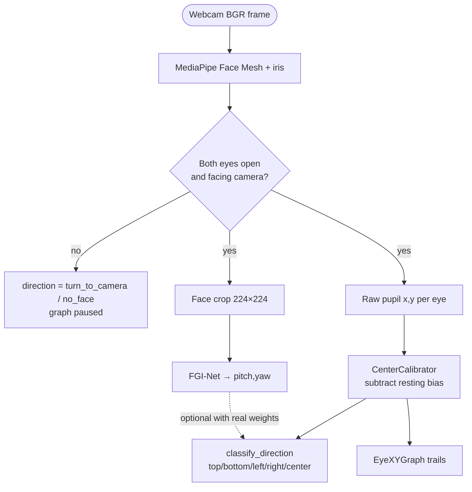

| Piece | Role |
|-------|------|
| `FaceEyeEngine` | Detect face anywhere; require both eyes facing |
| `CenterCalibrator` | Auto-lock resting gaze so plot center ≈ (0,0) |
| `EyeXYGraph` | Live Cartesian plot for left/right pupils |
| `FGI_Net` | Lightweight appearance gaze head (~1.5M params) |
| `demo.py` | Side-by-side camera + graph UI |

Run: `cd "eye tracking" && .\.venv\Scripts\activate && python demo.py`

---

## 13. Related files

| Concern | Path |
|---------|------|
| API entry | `python_backend/main.py` |
| Step 4 evaluate | `python_backend/services/ekyc_evaluation_service.py` |
| Evaluate route | `python_backend/controllers/evaluation_controller.py` |
| OCR service | `ocr_service/app.py` |
| Portal wizard | `public/app.js` |
| Eye tracker | `eye tracking/fgi_eye_tracker/tracker.py` |
| Eye demo | `eye tracking/demo.py` |
| Schema | `migrations/*.sql` |
| OpenAPI | `docs/openapi.yaml` |
