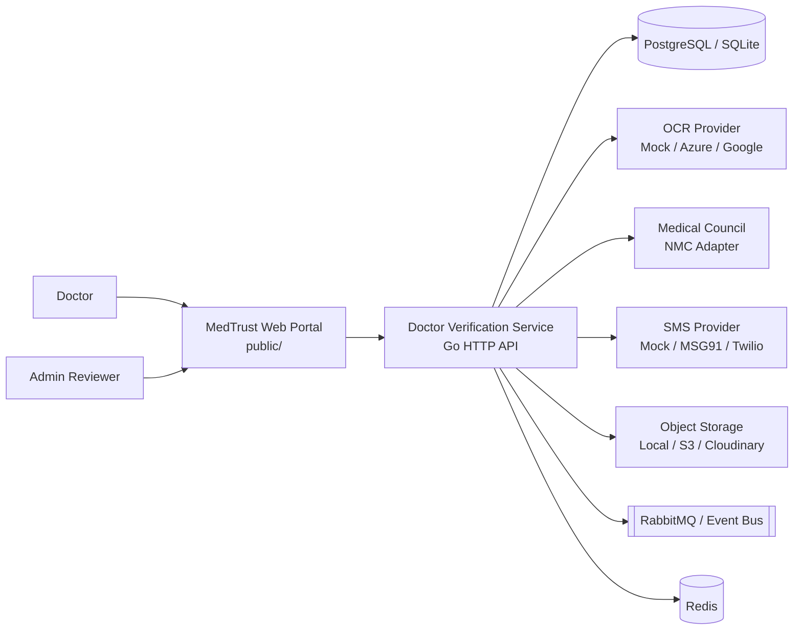
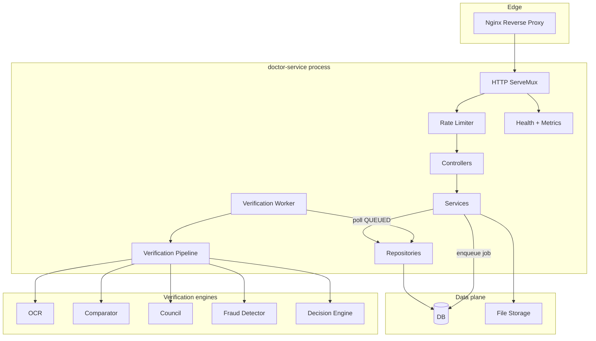
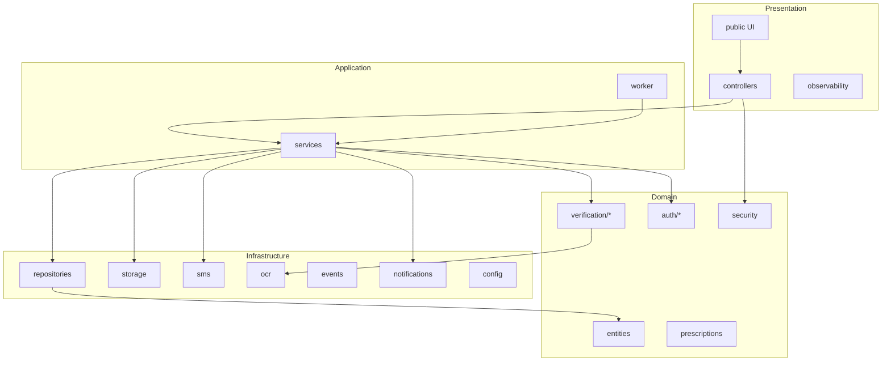
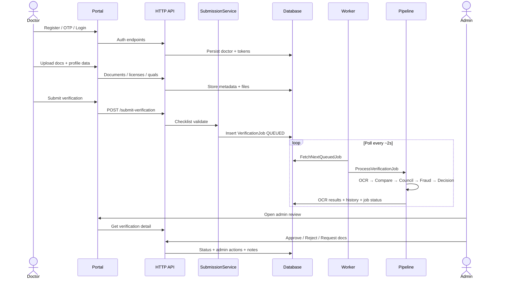
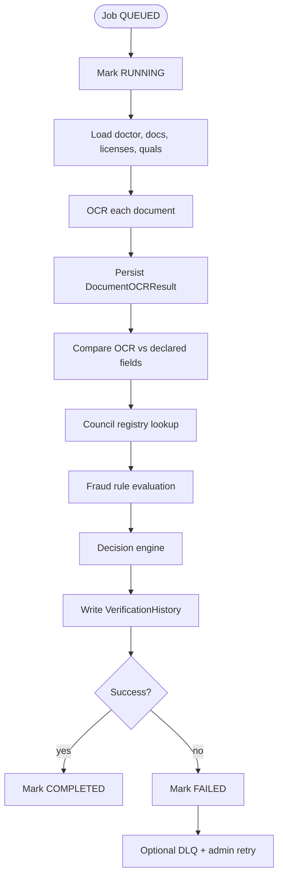
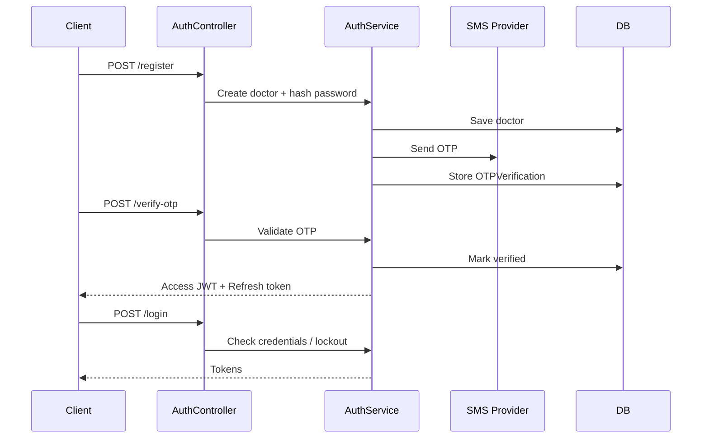
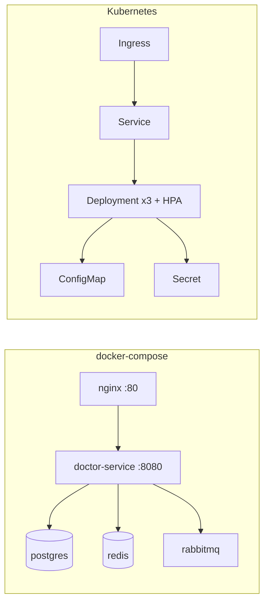

# Architecture Diagrams — Doctor eKYC Service

This document describes the **system context**, **runtime components**, **verification pipeline**, and **deployment** views of the Zudoc Doctor Portal eKYC service.

> Diagrams use [Mermaid](https://mermaid.js.org/). They render on GitHub and in most Markdown previewers.

---

## 1. System context

---

## 2. Runtime component view

---

## 3. Package / layered architecture

---

## 4. Doctor verification sequence

---

## 5. Verification pipeline detail

---

## 6. Auth flow

---

## 7. Deployment (Compose / K8s)

---

## 8. Trust boundary summary

| Boundary | Control |
|----------|---------|
| Public internet → API | Nginx, rate limits, JWT |
| Untrusted uploads → storage | Validator, scanner, size caps |
| Doctor → prescriptions | Verified-status guard |
| Pipeline → external council/OCR | Provider interfaces + timeouts/errors → job fail/DLQ |
| Admin actions → doctor status | Explicit admin APIs + action audit trail |
